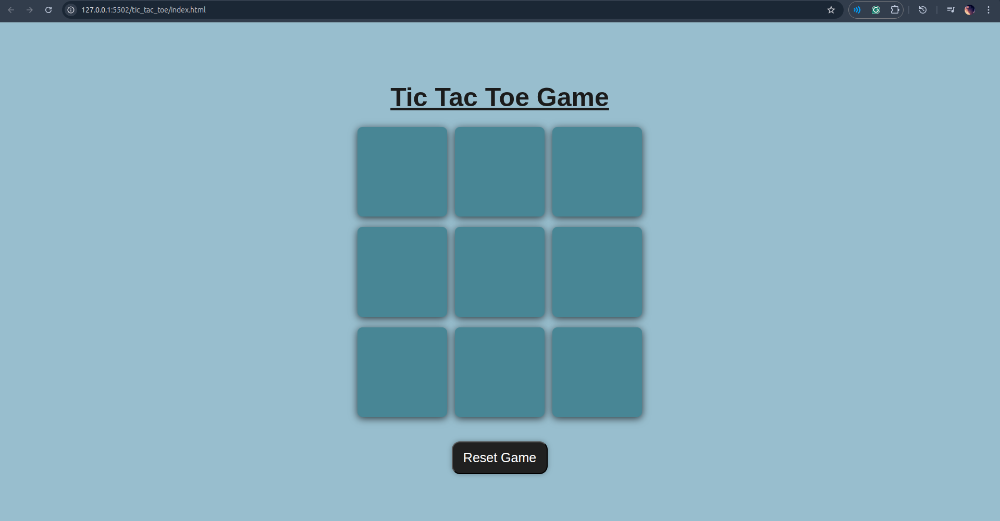
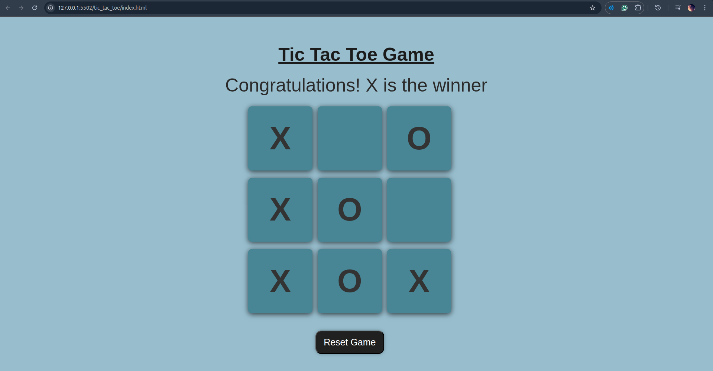
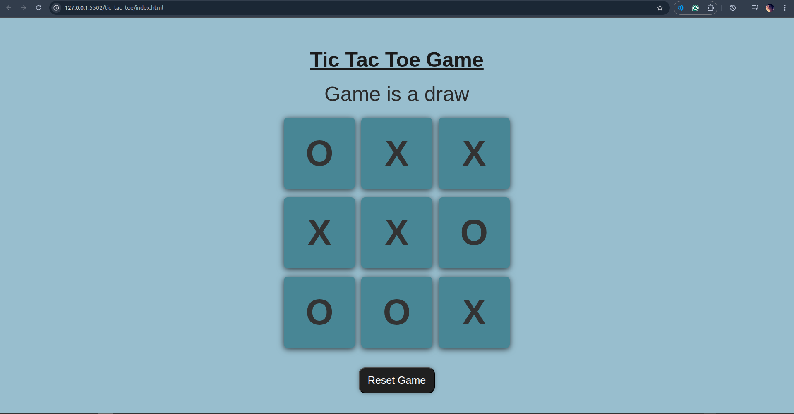

# 🎮 Tic Tac Toe Game

A simple yet fully functional **Tic Tac Toe** game built using **HTML**, **CSS**, and **JavaScript**.

## 🖼️ Screenshots

 <!-- optional: replace with actual image path -->

---

## 🧠 Features

- 🧍 Two-player gameplay (X and O)
- ❌ Win and ➖ Draw detection
- 🧼 Game reset functionality
- 💡 Dynamic DOM updates
- 📱 Responsive layout using `vmin` units

---

## 🚀 Live Demo

https://deep2234.github.io/Tic_Tac_Toe/

## 🛠️ Tech Stack

- **HTML5**
- **CSS3**
- **JavaScript**

---

## 🧩 How It Works

- The board is a 3x3 grid of buttons.
- Players take turns (X and O).
- The game checks for:
  - Winning combinations
  - A draw if all cells are filled
- Displays a message for winner or draw.
- Includes a reset button to start over.

---

## 📌 Learning Outcomes

- DOM manipulation using JavaScript
- Conditional logic
- Responsive design using `vmin`
- Event-driven programming

---

